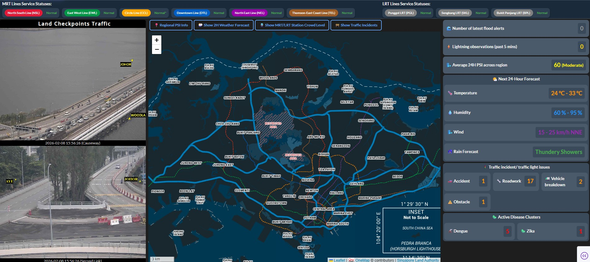

# Simple analytics enabled dashboard with (near) real-time information on weather, carpark and traffic conditions.

## Acknowledgement

### Data sources

All data are retrieved via API calls to data.gov.sg accessible [here](https://beta.data.gov.sg/). Key data sources involved are as follows:
1. **Weather Metrics**: Temperature, rainfall, relative humidity, and wind speed (V2 APIs)
2. **Environmental Alerts**: Lightning observations and flood alerts
3. **Exposure Indexes**: UV Index, WBGT (Wet-Bulb Globe Temperature), and PSI (Pollutant Standards Index) with multiple pollutants (PM2.5, PM10, SO₂, CO, O₃, NO₂)
4. **Health Clusters**: 
   - Zika cluster information (Data.gov.sg poll-download API)
   - Dengue cluster information (Data.gov.sg poll-download API)
5. **Transportation**: 
   - Bus stop locations (OneMap API)
   - Carpark availability (LTA DataMall CarParkAvailabilityv2 API)
   - HDB carpark information (Data.gov.sg initiate-download API)
   - Speed camera locations (Data.gov.sg initiate-download API)
   - Taxi availability (Data.gov.sg Taxi Availability API)
   - Traffic cameras (Data.gov.sg Traffic Images API)
   - ERP gantry locations (LTA Gantry GeoJSON dataset via Data.gov.sg initiate-download API)
   - Traffic speed bands (LTA DataMall TrafficSpeedBands v4 API)
   - Taxi stands (LTA DataMall TaxiStands API)
   - MRT/LRT service alerts (LTA DataMall TrainServiceAlerts API)
   - Faulty traffic lights (LTA DataMall FaultyTrafficLights API)
6. **Traffic**: Live traffic camera feeds at key locations

For developers, please refer to the link [here](https://guide.data.gov.sg/developers) on possible deprecation and updates on API and other information.


## Introduction

## What does this app show

This analytics dashboard provides real-time information on:

### Main Dashboard
- **Average PSI Reading**: 24-hour average Pollutant Standards Index across all regions (calculated from regional averages)
- **Meteorological Alerts Section**: 
  - **Number of latest flood alerts**: Flood alert count and detailed information
  - **Lightning observations (past 5 mins)**: Lightning detection count and location details
  - **Next 24-Hour Forecast**: Temperature, humidity, wind, and rain forecast
- **Traffic incident/ traffic light issues**: Traffic incidents and faulty traffic lights displayed in a grid format
- **MRT/LRT service alerts**: Real-time train service status and disruptions
- **Active Disease Clusters**: 
  - **Dengue clusters**: Count displayed in red-themed container
  - **Zika clusters**: Count displayed in red-themed container
- **Interactive Map**: Search locations and view nearby facilities (search bar positioned above map)
- **Map Toggle Controls**: 
  - **📍 Regional PSI Info**: Toggle visibility of PSI markers on map
  - **🌦️ Show 2H Forecast**: Toggle 2-hour weather forecast markers on map
- **Nearby Facilities**: Top 5 nearest MRT stations, bus stops, and HDB carparks with availability
- **Traffic Cameras**: Live CCTV feeds from land checkpoints
- **Standardized Card Design**: All right panel containers use consistent card-like design with headers and collapsible content
- **Layout**: Optimized 3:5:2 column ratio (left panel : map : right panel) with minimal gaps

### Realtime Weather Metrics Page
- **Live Weather Readings**: Temperature, rainfall, humidity, and wind speed from stations across Singapore
  - Temperature displays average value in sub-div
  - Lightning and flood readings display counts in sub-divs
- **WBGT (Wet-Bulb Globe Temperature)**: Heat stress measurements across Singapore with color-coded risk levels
  - Average WBGT value displayed in sub-div
  - Separate card from flood readings
- **Interactive Map**: Toggle visibility of different weather marker types
- **Status Indicators**: Lightning and flood alert indicators with color-coded status
- **View Sensor Location Tab**: Toggle visibility of weather sensor locations on map
  - Separate toggles for Flood and WBGT sensor locations

### Daily Health and Environmental Watch Page
- **UV Index**: Hourly trend visualization with line graph
- **Regional PSI Data**: Comprehensive pollutant readings including:
  - 24H Mean PSI, PM2.5, PM10, Sulphur Dioxide
  - 8H Mean Carbon Monoxide and Ozone
  - 1H Max Nitrogen Dioxide
- **PSI Display Modes**: Toggle between map text boxes and detailed metrics table
  - **Map View**: Regional pollutant data displayed as text boxes on map
  - **Table View**: Comprehensive table showing all PSI metrics with grid lines
- **Zika Clusters**: 
  - Polygon visualization of active Zika clusters on map
  - Toggle button: "Show Zika Cluster(s)" / "Don't Show Zika Cluster(s)"
  - Cluster information extracted from GeoJSON properties
- **Dengue Clusters**: 
  - Polygon visualization of active Dengue clusters on map
  - Toggle button: "Show Dengue Cluster(s)" / "Don't Show Dengue Cluster(s)"
  - Cluster count displayed on main dashboard
- **Interactive Map**: 
  - Standardized zoom level and boundaries across all pages
  - Average PSI value and category in region title
  - Color-coded pollutant values (PM values on left, others on right)
  - Full pollutant legend with color categories and thresholds
  - PSI color legend showing all risk levels
- **Toggle Controls**: All toggle buttons (PSI display mode, Zika clusters, Dengue clusters) positioned above map
- **Layout**: Optimized 2:6:2 ratio (indices panel : map : legend)

### Details on Transport Related Info Page
- **Taxi Availability**: Real-time taxi locations (4,500+ taxis) displayed as yellow markers on map
- **Traffic Cameras**: CCTV camera locations with live feed popups showing traffic conditions
- **ERP Gantries**: Electronic Road Pricing gantry locations displayed as red polylines on map
- **Traffic Speed Bands**: Real-time traffic speed data displayed as color-coded polylines on map
  - Speed bands range from 1 (0-9 km/h, red) to 8 (70+ km/h, green)
  - Speed band definitions displayed in information panel
- **Taxi Stands**: Taxi stand locations with detailed information (name, barrier-free access, ownership, type)
- **MRT/LRT Line Operational Status**: Real-time status for all MRT and LRT lines
  - MRT lines displayed with official colors (NSL-red, EWL-green, CCL-yellow, DTL-blue, NEL-purple, TEL-brown)
  - LRT lines (Punggol, Sengkang, Bukit Panjang) displayed in grey
  - Operational status and disruption details for each line
- **Toggle Controls**: Show/hide each transport layer independently
- **Metrics Display**: Count displays and information panels for all transport metrics
- **Zoomable Map**: Map supports zoom levels 10-19 for detailed exploration

## Application Structure

The dashboard consists of 5 main pages accessible via tabs with glossy black-to-silver gradient styling:

1. **🏠 Main Dashboard**: Overview with average PSI, meteorological alerts, traffic incidents, MRT/LRT service alerts, disease clusters, nearby facilities, and interactive map
   - **2-Hour Weather Forecast**: Toggle button on main page to show/hide 2-hour weather predictions with map markers
   - **Regional PSI Info**: Toggle button to show/hide PSI markers on map
   - **Standardized Card Design**: All right panel sections use consistent card-like design
2. **📡 Realtime Weather Metrics**: Live temperature, rainfall, humidity, and wind speed readings across Singapore
   - **WBGT Readings**: Heat stress measurements with average value display
   - **View Sensor Location Tab**: Toggle visibility of Flood and WBGT sensor locations
3. **📊 Daily Health and Environmental Watch**: UV Index trends, comprehensive PSI pollutant data, Zika clusters, and Dengue clusters
   - **PSI Display Modes**: Toggle between map text boxes and detailed metrics table
   - **Zika/Dengue Clusters**: Toggle visibility of cluster polygons on map
4. **Details on Transport Related Info**: Taxi availability, traffic cameras, ERP gantries, traffic speed bands, taxi stands, and MRT/LRT operational status
   - **Zoomable Map**: Supports zoom levels 10-19 for detailed exploration
5. **📍 Nearby Transportation & Parking**: Nearby bus stops, MRT/LRT stations, taxi stands, carparks, bicycle parking, and EV charging points

## Key Features

### Performance Optimizations
- **Async API Fetching**: Uses ThreadPoolExecutor for parallel API calls, reducing load times
  - Zika and Dengue cluster data fetched asynchronously
  - Parallel coordinate processing for large cluster datasets (>10 features)
- **Data Caching**: 
  - PSI data cached for 60 seconds to minimize redundant API requests
  - ERP gantry data cached for 24 hours (static dataset)
  - Dataset caches for initiate-download API endpoints
- **Efficient Map Rendering**: Automatic map resize handling when switching between tabs and toggling sections
- **Conditional Data Fetching**: 2H weather forecast only fetches data when section is visible
- **Startup Data Downloads**: 
  - HDB carpark information downloaded on startup (only if file doesn't exist)
  - Speed camera locations downloaded on startup (only if file doesn't exist)
  - Data stored in `data/` directory as CSV files

### Interactive Maps
- **Multi-layer Support**: Toggle visibility of different data layers (weather markers, transport facilities, taxis, cameras, ERP gantries, health clusters)
- **Standardized Configuration**: Consistent zoom levels, center coordinates, and boundaries across all pages
- **Location Search**: Search for any address in Singapore with autocomplete (white text on dark background)
- **Real-time Updates**: Auto-refresh every 30-60 seconds for live data
- **Custom Markers**: Color-coded markers and polylines for different data types
- **Polygon Visualization**: Zika and Dengue clusters displayed as colored polygons on map

### Data Visualization
- **UV Index Trends**: Line graph showing hourly UV index throughout the day
- **Regional PSI Display**: 
  - **Map View**: Text boxes on map showing pollutant readings for each region
    - Region title includes average PSI value and category
    - Pollutant values color-coded based on WHO/EPA air quality standards
    - Two-column layout: PM values (left) and other pollutants (right)
  - **Table View**: Comprehensive metrics table with grid lines showing all PSI values
    - Reduced padding (2rem) for compact display
    - All values displayed in organized grid format
- **Health Cluster Visualization**: 
  - Zika clusters displayed as polygons with cluster information
  - Dengue clusters displayed as polygons with cluster counts
  - Cluster data extracted from GeoJSON properties via HTML parsing
- **Color-coded Risk Levels**: Visual indicators for air quality, heat stress, and environmental alerts
  - PSI categories: Good (green), Moderate (yellow), Unhealthy (orange), Very Unhealthy (red), Hazardous (purple)
  - Pollutant thresholds: Color-coded values for PM2.5, PM10, SO₂, CO, O₃, NO₂
- **Comprehensive Legends**: 
  - PSI color categories legend with source attribution
  - Pollutant color categories table with thresholds and source attribution
  - Legends fill vertical space of parent containers using flexbox
- **Live Camera Feeds**: Embedded traffic camera images in map popups
- **Responsive Styling**: All measurements use `rem` units for scalability across different screen sizes
- **Modern UI Design**:
  - Glossy navigation tabs with black-to-silver linear gradient (top to bottom)
  - Active tabs feature vibrant gradient colors (purple-blue gradient)
  - Consistent styling across all interactive elements
  - White text on dark backgrounds for improved readability

## Known Limitations and Restrictions
### Speed Band Visualization
- **Speed band plotting requires zoomed-in view**: Due to the massive number of traffic speed band segments (>100,000) returned by the LTA DataMall API, plotting all segments at once can cause the web browser to hang or become unresponsive. To mitigate this, speed band visualization is only displayed when the map is zoomed in to a sufficient level, reducing the number of visible segments and ensuring smooth performance.

## Screenshots of app

### Main Dashboard Page

*The main dashboard showing real-time weather metrics with interactive map markers, indicators for lightning and flood alerts, average PSI reading, and nearby transportation information.*

### Daily Health and Environmental Watch Page

*Displays UV Index hourly trends, regional PSI values with color-coded risk levels across Singapore's five regions (North, South, East, West, Central), Zika cluster polygons, and Dengue cluster polygons. Features toggle controls for PSI display mode (map vs. table), Zika clusters, and Dengue clusters positioned above the map.*

## Built with following:
* [Dash](https://dash.plot.ly/) - Main server and interactive components 
* [Plotly Python](https://plot.ly/python/) - Used to create the interactive plots
* [Dash Leaflet](https://github.com/thedirtyfew/dash-leaflet) - Interactive map components with Leaflet.js
* [Dash DAQ](https://dash.plot.ly/dash-daq) - Styled technical components for industrial applications
* **ThreadPoolExecutor** - Async API fetching for improved performance and parallel data retrieval

### Supported by following APIs/tokens (you will need to register an account to get access tokens for use):

Please refer to the provided link for more information
* [Data.gov.sg API](https://beta.data.gov.sg/) - Primary data source for:
  - Weather data (V2 APIs): Temperature, rainfall, humidity, wind speed
  - Environmental alerts: Lightning observations, flood alerts
  - Exposure indexes: UV Index, WBGT, PSI with pollutants
  - Transport data: Taxi availability, traffic camera images
  - Health clusters: Zika and Dengue cluster information via poll-download API
* [LTA DataMall API Access](https://datamall.lta.gov.sg/content/datamall/en.html) - Transportation related data
  - Carpark availability: CarParkAvailabilityv2 API endpoint
  - Traffic speed bands: TrafficSpeedBands v4 API endpoint
  - Taxi stands: TaxiStands API endpoint
  - Train service alerts: TrainServiceAlerts API endpoint
  - Faulty traffic lights: FaultyTrafficLights API endpoint
  - Requires LTA DataMall API key
* [OneMap API](https://www.onemap.gov.sg/apidocs/) - Geospatial services:
  - Location search and geocoding
  - Nearby transport facilities (bus stops, MRT stations)
  - Map tiles for visualization (Night theme)
* [Data.gov.sg Initiate-Download API](https://api-open.data.gov.sg/v1/public/api/datasets/) - Dataset downloads:
  - HDB Carpark Information: Dataset ID `d_23f946fa557947f93a8043bbef41dd09`
  - Speed Camera Locations: Dataset ID `d_983804de2bc016f53e44031d85d1ec8a`
  - ERP Gantry Locations: Dataset ID `d_753090823cc9920ac41efaa6530c5893`
* [Data.gov.sg Poll-Download API](https://api-open.data.gov.sg/v1/public/api/datasets/) - Health cluster data:
  - Zika Clusters: Dataset ID `d_a3c783f11d79ff7feb8856f762ccf2c5`
  - Dengue Clusters: Dataset ID `d_dbfabf16158d1b0e1c420627c0819168`

## Requirements

### Python Dependencies

We suggest you to create an Anaconda environment using the requirements.yml file provided, and install all of the required dependencies listed within. In your Terminal/Command Prompt:

```bash
git clone https://github.com/plotly/Dash-sample-analytics-dashboard-concept.git
cd Dash-sample-analytics-dashboard-concept
conda create -f requirements.txt
```

If you prefer to install all of the required packages in your own Anaconda environment, simply activate your own Anaconda environment and execute the following command with your activated environment:

```bash
pip install -r requirements.txt
```

### Key Dependencies

- **dash**: Web framework for building interactive dashboards
- **dash-leaflet**: Interactive map components
- **plotly**: Data visualization and graphing
- **requests**: HTTP library for API calls
- **python-dotenv**: Environment variable management
- **pyproj**: Coordinate system transformations (SVY21 to WGS84)
- **pandas**: Data manipulation for carpark locations
- **numpy**: Numerical operations for UV Index graphing
- **concurrent.futures**: ThreadPoolExecutor for async API fetching
- **gunicorn**: WSGI HTTP server for Plotly Cloud deployment

All required packages will be installed, and the app will be able to run.


## Environment Setup

Create a `.env` file in the root directory with the following API keys:

```env
# Data.gov.sg API key (required for weather, PSI, taxi, traffic camera, and health cluster data)
DATA_GOV_API=your_data_gov_api_key_here

# OneMap API key (required for location search and nearby facilities)
ONEMAP_API_KEY=your_onemap_api_key_here

# LTA DataMall API key (required for carpark availability)
LTA_API_KEY=your_lta_api_key_here
```

### Getting API Keys

1. **Data.gov.sg API Key**: 
   - Sign up at [Data.gov.sg](https://beta.data.gov.sg/)
   - Navigate to your account settings to generate an API key
   - Required for: Weather data, PSI, UV Index, WBGT, taxi availability, traffic cameras, Zika/Dengue clusters

2. **OneMap API Key**:
   - Register at [OneMap](https://www.onemap.gov.sg/)
   - Generate an API key from your account dashboard
   - Required for: Location search, nearby bus stops, MRT stations

3. **LTA DataMall API Key**:
   - Register at [LTA DataMall](https://datamall.lta.gov.sg/content/datamall/en.html)
   - Generate an API key from your account dashboard
   - Required for: Real-time carpark availability (CarParkAvailabilityv2 API)

## Using this application

### Local Development

Run this app locally by:
```
python app.py
```
Open http://0.0.0.0:8050/ in your browser, you will see an interactive dashboard.

### Plotly Cloud Deployment

The application is configured for Plotly Cloud deployment:
- `gunicorn` is included in `requirements.txt`
- `server = app.server` is exposed for WSGI compatibility
- `app.run()` is conditional and only executes in local development mode
- For deployment, use: `gunicorn app:server`

The application will automatically:
- Download HDB carpark information on startup (if `data/HDBCarparkInformation.csv` doesn't exist)
- Download speed camera locations on startup (if `data/speed_camera.csv` doesn't exist)
- Initialize OneMap API authentication on startup
- Fetch and cache data from various APIs
- Update displays every 30-60 seconds
- Handle map resizing when switching tabs and toggling sections
- Apply color coding to pollutant values based on air quality standards
- Display comprehensive legends for PSI and pollutant categories with source attribution
- Fetch Zika and Dengue cluster data asynchronously for optimal performance
- Process cluster coordinates in parallel for large datasets

## Other miscellaneous information

### Traffic Camera ID geolocations information as of 13 Dec 2022.

|ID|Lat|Lon|Description of Location|
|---|---|---|---|
|1001|1.29531332|103.871146|ECP/MCE/KPE instersection|
|1002|1.319541067|103.8785627|PIE(Tuas) exit road to KPE(MCE)|
|1003|1.323957439|103.8728576|PIE(Changi) exit road to KPE(TPE)|
|1004|1.319535712|103.8750668|PIE(Changi) exit to KPE(TPE)/Sims Way|
|1005|1.363519886|103.905394|KPE(TPE) Defu Flyover|
|1006|1.357098686|103.902042|KPE(MCE) Tunnel Entrance| 
|1501|1.274143944|103.8513168|Straits Boulevard to MCE|
|1502|1.271350907|103.8618284|Slip Road to MCE from Marina Link|
|1503|1.270664087|103.8569779|MCE(KPE) near Slip road to Central Boulevard|
|1504|1.294098914|103.8760562|Slip Road from ECP(Sheares) to MCE(AYE)|
|1505|1.275297715|103.8663904|Slip Road from Marina Coastal Drive to MCE(KPE)|
|1701|1.323604823|103.8587802|CTE Whampoa River|
|1702|1.34355015|103.8601984|CTE Braddell Flyover|
|1703|1.328147222|103.8622033|CTE Whampoa Flyover|
|1704|1.285693989|103.8375245|CTE/Chin Swee Road|
|1705|1.375925022|103.8587986|CTE Ang Mo Kio Flyover|
|1706|1.38861|103.85806|CTE Yio Chu Kang Flyover|
|1707|1.280365843|103.8304511|AYE(Tuas) Jalan Bukit Merah Exit|
|1709|1.313842317|103.845603|CTE(AYE) Cavenagh Exit|
|1711|1.35296|103.85719|CTE Ang Mo Kio South Flyover|
|2701|1.447023728|103.7716543|Causeway|
|2702|1.445554109|103.7683397|BKE Entrance after Causeway|
|2703|1.350477908|103.7910336|BKE/PIE Intersection|
|2704|1.429588536|103.769311|BKE Woodlands Flyover|
|2705|1.36728572|103.7794698|BKE Dairy Farm Flyover|
|2706|1.414142|103.771168|BKE Between Turf Club and Mandai Road exits|
|2707|1.3983|103.774247|BKE Between KJE and Mandai Road exits|
|2708|1.3865|103.7747|BKE(Woodlands) before Slip road to KJE|
|3702|1.33831|103.98032|ECP/PIE(Changi) Intersection|
|3704|1.295855016|103.8803147|ECP(Changi)/Slip Road from MCE to ECP(Changi)|
|3705|1.32743|103.97383|ECP(Sheares) Before Xilin Ave exit|
|3793|1.309330837|103.9350504|ECP Laguna Flyover|
|3795|1.301451452|103.9105963|ECP Marina Parade Flyover|
|3796|1.297512569|103.8983019|ECP Tanjong Katong Flyover|
|3797|1.295657333|103.885283|ECP Tanjong Rhu Flyover|
|3798|1.29158484|103.8615987|ECP Benjamin Sheares Bridge over Raffles Boulevard|
|4701|1.2871|103.79633|AYE Before Portsdown Flyover|
|4702|1.27237|103.8324|AYE Keppel Viaduct|
|4703|1.348697862|103.6350413|AYE After Tuas Checkpoint|
|4704|1.27877|103.82375|AYE Lower Delta Flyover|
|4705|1.32618|103.73028|AYE(MCE) after Yuan Ching Road Exit|
|4706|1.29792|103.78205|AYE(Tuas) After Buona Vista Flyover|
|4707|1.333446481|103.6527008|AYE(MCE) beside Jalan Ahmad Ibrahim|
|4708|1.29939|103.7799|AYE(MCE) beside Singapore Institute of Technology|
|4709|1.312019|103.763002|AYE(Tuas) before Exit to Clementi Ave 6|
|4710|1.32153|103.75273|AYE Pandan River Flyover|
|4712|1.341244001|103.6439134|AYE Jalan Ahmad Ibrahim slip road entrance/exit|
|4713|1.347645829|103.6366955|AYE Before Tuas Checkpoint|
|4714|1.31023|103.76438|AYE(Tuas) After Clementi Flyover|
|4716|1.32227|103.67453|AYE(Tuas) After Benoi Flyover|
|4798|1.259999997|103.8236111|Sentosa Gateway to Harbourfront|
|4799|1.260277774|103.8238889|Sentosa Gateway (Entrance/Exit to Sentosa)|
|5794|1.3309693|103.9168616|PIE(Tuas) After Bedok North Flyover|
|5795|1.326024822|103.905625|PIE Eunos Flyover|
|5797|1.322875288|103.8910793|PIE Paya Lebar Flyover|
|5798|1.320360781|103.8771741|PIE Aljunied West Flyover|
|5799|1.328171608|103.8685191|PIE Woodsville Flyover|
|6701|1.329334|103.858222|PIE(Tuas) Exit to Kim Keat Link|
|6703|1.328899|103.84121|PIE Thomson Flyover|
|6704|1.326574036|103.8268573|PIE Mount Pleasant Flyover|
|6705|1.332124|103.81768|PIE(Changi) after Adam Flyover|
|6706|1.349428893|103.7952799|PIE(Changi) after BKE exit|
|6708|1.345996|103.69016|PIE Nanyang Flyover|
|6710|1.344205|103.78577|PIE(Changi) Anak Bukit Flyover|
|6711|1.33771|103.977827|PIE(Changi) Exit from ECP|
|6712|1.332691|103.7702788179709|PIE(Tuas) before slip road to Clementi Ave 6|
|6713|1.340298|103.945652|PIE(Tuas) after Tampines South Flyover|
|6714|1.361742|103.703341|PIE(Changi) exit to KJE(BKE)
|6715|1.356299|103.716071|PIE Hong Kah Flyover|
|6716|1.322893|103.6635051|AYE/PIE Tuas Flyover|
|7791|1.354245|103.963782|TPE Upper Changi Flyover|
|7793|1.37704704|103.9294698|TPE Api Api Flyover|
|7794|1.37988658|103.9200917|TPE(SLE) slip road to KJE|
|7795|1.38432741|103.915857|TPE(Changi) after Halus Bridge|
|7796|1.39559294|103.9051571|TPE(SLE) before Punggol Flyover|
|7797|1.40002575|103.8570253|TPE/Seletar West Link Intersection|
|7798|1.39748842|103.8540047|TPE(SLE) exit to SLE|
|8701|1.38647|103.74143|KJE Choa Chu Kang West Flyover|
|8702|1.39059|103.7717|KJE Gali Batu Flyover|
|8704|1.3899|103.74843|KJE(BKE) After Choa Chu Kang Dr|
|8706|1.3664|103.70899|PIE(Tuas) Slip Road to KJE|
|9701|1.39466333|103.834746|SLE Lentor Flyover|
|9702|1.39474081|103.8179709|SLE Upper Thomson Flyover|
|9703|1.422857|103.773005|SLE/BKE Interchange|
|9704|1.42214311|103.7954206|SLE Ulu Sembawang Flyover|
|9705|1.42627712|103.7871664|SLE Marsiling Flyover|
|9706|1.41270056|103.8064271|SLE Mandai Lake Flyover|

## Setup

Work in progress

## Background
Work in progress

## Problem statement

Work in progress

## Summary of Findings & Recommendations

Work in progress