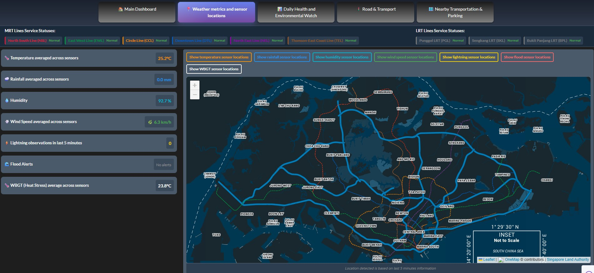
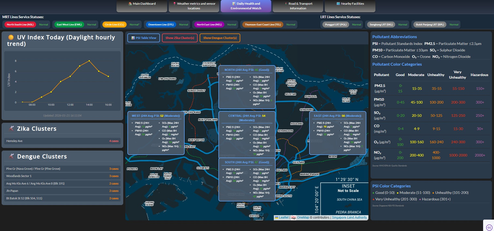
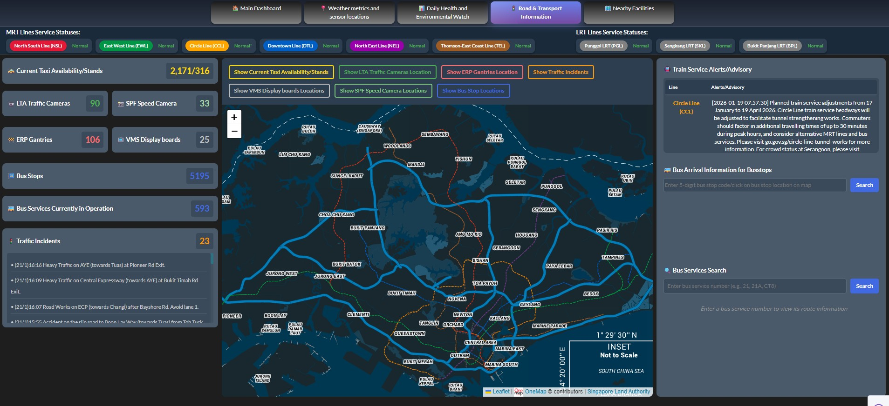
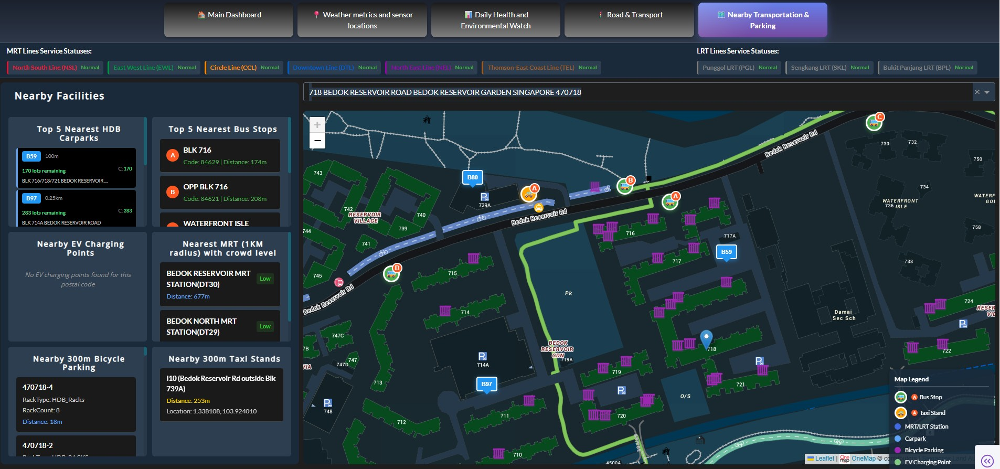

# Simple analytics enabled dashboard with (near) real-time information on weather, carpark and traffic conditions.

## Overview
This app is a multi-tab dashboard for Singapore that brings together weather, transport, and environmental data in one place.
It focuses on quick, readable summaries and interactive maps to explore nearby facilities and live conditions.

## Acknowledgement

### Data sources

All data are retrieved via API calls to data.gov.sg accessible [here](https://beta.data.gov.sg/). Key data sources involved are as follows:
1. **Weather Metrics**: Temperature, rainfall, relative humidity, and wind speed (V2 APIs)
2. **Environmental Alerts**: Lightning observations and flood alerts
3. **Exposure Indexes**: UV Index, WBGT (Wet-Bulb Globe Temperature), and PSI (Pollutant Standards Index) with multiple pollutants (PM2.5, PM10, SO₂, CO, O₃, NO₂)
4. **Health Clusters**: 
   - Zika cluster information (Data.gov.sg poll-download API)
   - Dengue cluster information (Data.gov.sg poll-download API)
5. **Transportation**: 
   - Bus stop locations (OneMap API)
   - Carpark availability (LTA DataMall CarParkAvailabilityv2 API)
   - HDB carpark information (Data.gov.sg initiate-download API)
   - Speed camera locations (Data.gov.sg initiate-download API)
   - Taxi availability (Data.gov.sg Taxi Availability API)
   - Traffic cameras (Data.gov.sg Traffic Images API)
   - ERP gantry locations (LTA Gantry GeoJSON dataset via Data.gov.sg initiate-download API)
   - Taxi stands (LTA DataMall TaxiStands API)
   - MRT/LRT service alerts (LTA DataMall TrainServiceAlerts API)
   - Faulty traffic lights (LTA DataMall FaultyTrafficLights API)
6. **Traffic**: Live traffic camera feeds at key locations

For developers, please refer to the link [here](https://guide.data.gov.sg/developers) on possible deprecation and updates on API and other information.


## Introduction
If you want a quick overview, see the screenshots section below. A more detailed feature breakdown follows.

## What does this app show

This analytics dashboard provides real-time information on:

### Main Dashboard
- **Average PSI Reading**: 24-hour average Pollutant Standards Index across all regions (calculated from regional averages)
- **Meteorological Alerts Section**: 
  - **Number of latest flood alerts**: Flood alert count displayed in standardized metric card format (updates every 3 minutes)
  - **Lightning observations (past 5 mins)**: Lightning detection count displayed in standardized metric card format
  - **Next 24-Hour Forecast**: Temperature, humidity, wind, and rain forecast
- **Traffic incident/ traffic light issues**: Traffic incidents and faulty traffic lights displayed in a grid format
- **MRT/LRT service alerts**: Real-time train service status and disruptions
  - Line status displayed with colored pill badges showing line name and abbreviation
  - Status indicators shown as colored text (green for Normal, red for disruptions)
  - "Normal*" indicator when service is normal but advisory messages exist
- **Active Disease Clusters**: 
  - **Dengue clusters**: Count displayed in red-themed container
  - **Zika clusters**: Count displayed in red-themed container
- **Interactive Map**: Search locations and view nearby facilities (search bar positioned above map)
- **Map Toggle Controls**: 
  - **📍 Regional PSI Info**: Toggle visibility of PSI markers on map
  - **🌦️ Show 2H Forecast**: Toggle 2-hour weather forecast markers on map
- **Nearby Facilities**: Top 5 nearest MRT stations, bus stops, and HDB carparks with availability
- **Traffic Cameras**: Live CCTV feeds from land checkpoints
  - Images display with full resolution (no cropping)
  - Timestamp and location shown as captions below each image
- **Standardized Card Design**: All right panel containers use consistent card-like design with headers and collapsible content
- **Layout**: Optimized 3:5:2 column ratio (left panel : map : right panel) with minimal gaps

### Realtime Weather Metrics Page
- **Live Weather Readings**: Temperature, rainfall, humidity, and wind speed from stations across Singapore
  - Temperature displays average value in sub-div
  - Lightning and flood readings display counts in sub-divs
- **WBGT (Wet-Bulb Globe Temperature)**: Heat stress measurements across Singapore with color-coded risk levels
  - Average WBGT value displayed in sub-div
  - Separate card from flood readings
- **Interactive Map**: Toggle visibility of different weather marker types
- **Status Indicators**: Lightning and flood alert indicators with color-coded status
- **View Sensor Location Tab**: Toggle visibility of weather sensor locations on map
  - Separate toggles for Flood and WBGT sensor locations

### Daily Health and Environmental Watch Page
- **UV Index**: Hourly trend visualization with line graph
- **Regional PSI Data**: Comprehensive pollutant readings including:
  - 24H Mean PSI, PM2.5, PM10, Sulphur Dioxide
  - 8H Mean Carbon Monoxide and Ozone
  - 1H Max Nitrogen Dioxide
- **PSI Display Modes**: Toggle between map text boxes and detailed metrics table
  - **Map View**: Regional pollutant data displayed as text boxes on map
  - **Table View**: Comprehensive table showing all PSI metrics with grid lines
- **Zika Clusters**: 
  - Polygon visualization of active Zika clusters on map
  - Toggle button: "Show Zika Cluster(s)" / "Don't Show Zika Cluster(s)"
  - Cluster information extracted from GeoJSON properties
- **Dengue Clusters**: 
  - Polygon visualization of active Dengue clusters on map
  - Toggle button: "Show Dengue Cluster(s)" / "Don't Show Dengue Cluster(s)"
  - Cluster count displayed on main dashboard
- **Interactive Map**: 
  - Standardized zoom level and boundaries across all pages
  - Average PSI value and category in region title
  - Color-coded pollutant values (PM values on left, others on right)
  - Full pollutant legend with color categories and thresholds
  - PSI color legend showing all risk levels
- **Toggle Controls**: All toggle buttons (PSI display mode, Zika clusters, Dengue clusters) positioned above map
- **Layout**: Optimized 2:6:2 ratio (indices panel : map : legend)

### Road & Transport Information Page
- **Taxi Availability**: Real-time taxi locations (4,500+ taxis) displayed as yellow markers on map
- **Traffic Cameras**: CCTV camera locations with live feed popups showing traffic conditions
- **ERP Gantries**: Electronic Road Pricing gantry locations displayed as red polylines on map
- **Taxi Stands**: Taxi stand locations with detailed information (name, barrier-free access, ownership, type)
- **MRT/LRT Line Operational Status**: Real-time status for all MRT and LRT lines
  - Line status displayed with colored pill badges (line color background, white text)
  - MRT lines displayed with official colors (NSL-red, EWL-green, CCL-yellow, DTL-blue, NEL-purple, TEL-brown)
  - LRT lines (Punggol, Sengkang, Bukit Panjang) displayed in grey
  - Status indicators shown as colored text outside the pill badge
  - "Normal*" indicator when service is normal but advisory messages exist
  - Train service advisories displayed in table format (top 5 entries) with line, published time, and message columns
- **Bus Stops**: Interactive bus stop markers with arrival time information
  - Bus stops displayed as clickable markers (visible at zoom level 15+)
  - Clicking a bus stop displays arrival times in side panel and highlights the stop on map
  - Bus stop selection persists when navigating the map (no auto-selection on viewport changes)
  - Re-center button available to return to selected bus stop location
  - Viewport filtering for optimal performance (only renders visible bus stops)
- **Toggle Controls**: Show/hide each transport layer independently
- **Metrics Display**: Standardized metric cards for bus stops and bus services counts
- **Zoomable Map**: Map supports zoom levels 10-19 for detailed exploration

## Application Structure

The dashboard consists of 4 main pages accessible via tabs with glossy black-to-silver gradient styling:

1. **🏠 Main Dashboard**: Overview with average PSI, meteorological alerts, traffic incidents, MRT/LRT service alerts, disease clusters, nearby facilities, and interactive map
   - **2-Hour Weather Forecast**: Toggle button on main page to show/hide 2-hour weather predictions with map markers
   - **Regional PSI Info**: Toggle button to show/hide PSI markers on map
   - **Standardized Card Design**: All right panel sections use consistent card-like design
2. **📡 Realtime Weather Metrics**: Live temperature, rainfall, humidity, and wind speed readings across Singapore
   - **WBGT Readings**: Heat stress measurements with average value display
   - **View Sensor Location Tab**: Toggle visibility of Flood and WBGT sensor locations
3. **📊 Daily Health and Environmental Watch**: UV Index trends, comprehensive PSI pollutant data, Zika clusters, and Dengue clusters
   - **PSI Display Modes**: Toggle between map text boxes and detailed metrics table
   - **Zika/Dengue Clusters**: Toggle visibility of cluster polygons on map
4. **🚦 Road & Transport Information**: Taxi availability, traffic cameras, ERP gantries, taxi stands, bus stops, and MRT/LRT operational status
   - **Bus Stop Interaction**: Click bus stops to view arrival times (zoom level 15+ required)
   - **Selection Persistence**: Selected bus stops remain active during map navigation
   - **Zoomable Map**: Supports zoom levels 10-19 for detailed exploration
5. **📍 Nearby Facilities**: Nearby bus stops, MRT/LRT stations, taxi stands, carparks, bicycle parking, and EV charging points

## Key Features

### Performance Optimizations
- **Async API Fetching**: All API calls use `@run_in_thread` decorator with ThreadPoolExecutor for parallel, non-blocking API requests
  - All fetch functions are async-only, using the `run_in_thread` decorator pattern
  - Flood alerts, lightning observations, weather data, and transport data fetched asynchronously
  - Zika and Dengue cluster data fetched asynchronously
  - Parallel coordinate processing for large cluster datasets (>10 features)
  - Consistent async pattern across all API calls for improved responsiveness and scalability
- **Data Caching**: 
  - PSI data cached for 60 seconds to minimize redundant API requests
  - ERP gantry data cached for 24 hours (static dataset)
  - Bus stops and bus routes data cached with monthly refresh buckets
  - Dataset caches for initiate-download API endpoints
- **Efficient Map Rendering**: 
  - Automatic map resize handling when switching between tabs and toggling sections
  - Viewport filtering for bus stops (only renders markers visible in current view)
  - Conditional marker rendering based on zoom level
- **Conditional Data Fetching**: 2H weather forecast only fetches data when section is visible
- **Startup Data Downloads**: 
  - HDB carpark information downloaded on startup (only if file doesn't exist)
  - Speed camera locations downloaded on startup (only if file doesn't exist)
  - Data stored in `data/` directory as CSV files

### Interactive Maps
- **Multi-layer Support**: Toggle visibility of different data layers (weather markers, transport facilities, taxis, cameras, ERP gantries, health clusters)
- **Standardized Configuration**: Consistent zoom levels, center coordinates, and boundaries across all pages
- **Location Search**: Search for any address in Singapore with autocomplete (white text on dark background)
- **Real-time Updates**: Auto-refresh every 30-60 seconds for live data (flood alerts update every 3 minutes)
- **Custom Markers**: Color-coded markers and polylines for different data types
- **Polygon Visualization**: Zika and Dengue clusters displayed as colored polygons on map
- **User-Controlled Selection**: Bus stop selection only changes on explicit user clicks, not on map navigation
- **Persistent Selection**: Selected bus stops remain active when panning/zooming the map

### Data Visualization
- **UV Index Trends**: Line graph showing hourly UV index throughout the day
- **Regional PSI Display**: 
  - **Map View**: Text boxes on map showing pollutant readings for each region
    - Region title includes average PSI value and category
    - Pollutant values color-coded based on WHO/EPA air quality standards
    - Two-column layout: PM values (left) and other pollutants (right)
  - **Table View**: Comprehensive metrics table with grid lines showing all PSI values
    - Reduced padding (2rem) for compact display
    - All values displayed in organized grid format
- **Health Cluster Visualization**: 
  - Zika clusters displayed as polygons with cluster information
  - Dengue clusters displayed as polygons with cluster counts
  - Cluster data extracted from GeoJSON properties via HTML parsing
- **Color-coded Risk Levels**: Visual indicators for air quality, heat stress, and environmental alerts
  - PSI categories: Good (green), Moderate (yellow), Unhealthy (orange), Very Unhealthy (red), Hazardous (purple)
  - Pollutant thresholds: Color-coded values for PM2.5, PM10, SO₂, CO, O₃, NO₂
- **Comprehensive Legends**: 
  - PSI color categories legend with source attribution
  - Pollutant color categories table with thresholds and source attribution
  - Legends fill vertical space of parent containers using flexbox
- **Live Camera Feeds**: Embedded traffic camera images in map popups
- **Responsive Styling**: 
  - All measurements use `rem` units for consistent scaling across different screen sizes
  - Responsive column layouts for traffic incidents and disease clusters based on data availability
  - Traffic incidents: 3-column display for 3+ types, 2-column for 2 types, 1-column for 1 type
  - Disease clusters: 2-column display for 2 types (Dengue and Zika), 1-column for 1 type
- **Modern UI Design**:
  - Glossy navigation tabs with black-to-silver linear gradient (top to bottom)
  - Active tabs feature vibrant gradient colors (purple-blue gradient)
  - Compact header design with reduced padding and font sizes
  - Consistent styling across all interactive elements
  - White text on dark backgrounds for improved readability
  - Vertically scrollable layout to accommodate all content
  - Consistent page heights across all tabs (main dashboard matches other tab heights)
- **Standardized Metric Cards**: Reusable metric card component used across main dashboard, weather metrics, and transport pages
  - Consistent design pattern for all metric displays
  - Unified styling for count/value displays
  - Supports additional children (e.g., disclaimers) for context-specific information
- **Reusable Components**:
  - MRT/LRT line status banner component for consistent display across pages
  - Centralized line configuration (colors, names, abbreviations) in `conf/mrt_line_config.py`
  - Modular component structure for easier maintenance and updates

## Known Limitations and Restrictions
### Bus Stop Visualization
- **Bus stop markers require zoom level 15+**: Bus stops are only displayed when zoomed in to level 15 or higher to optimize map performance and reduce visual clutter
- **Viewport filtering**: Only bus stops visible in the current map viewport are rendered, improving performance when zoomed out
- **Bus stop marker deviation**: Bus stop markers may deviate from actual locations due to ongoing road construction works (disclaimer shown when bus stops are displayed)

## Screenshots of app
All sample screenshots are stored in `assets/img` with `.jpg` extensions for clarity.

### Main Dashboard Page

*Overview of key alerts, PSI, and the interactive map.*

### Realtime Weather Metrics Page

*Live weather readings across stations and sensor locations.*

### Daily Health and Environmental Watch Page

*UV index trends, PSI details, and cluster overlays.*

### Road & Transport Information Page

*Traffic, taxi, and transport layers on the map.*

### Nearby Facilities Page

*Top nearby transport options and parking facilities.*

## Built with following:
* [Dash](https://dash.plot.ly/) - Main server and interactive components 
* [Plotly Python](https://plot.ly/python/) - Used to create the interactive plots
* [Dash Leaflet](https://github.com/thedirtyfew/dash-leaflet) - Interactive map components with Leaflet.js
* [Dash DAQ](https://dash.plot.ly/dash-daq) - Styled technical components for industrial applications
* **ThreadPoolExecutor** - Async API fetching for improved performance and parallel data retrieval
* **@run_in_thread decorator** - Consistent async pattern using `run_in_thread` decorator from `utils.async_fetcher` for all API calls

### Supported by following APIs/tokens (you will need to register an account to get access tokens for use):

Please refer to the provided link for more information
* [Data.gov.sg API](https://beta.data.gov.sg/) - Primary data source for:
  - Weather data (V2 APIs): Temperature, rainfall, humidity, wind speed
  - Environmental alerts: Lightning observations, flood alerts
  - Exposure indexes: UV Index, WBGT, PSI with pollutants
  - Transport data: Taxi availability, traffic camera images
  - Health clusters: Zika and Dengue cluster information via poll-download API
* [LTA DataMall API Access](https://datamall.lta.gov.sg/content/datamall/en.html) - Transportation related data
  - Carpark availability: CarParkAvailabilityv2 API endpoint
  - Taxi stands: TaxiStands API endpoint
  - Train service alerts: TrainServiceAlerts API endpoint
  - Faulty traffic lights: FaultyTrafficLights API endpoint
  - Requires LTA DataMall API key
* [OneMap API](https://www.onemap.gov.sg/apidocs/) - Geospatial services:
  - Location search and geocoding
  - Nearby transport facilities (bus stops, MRT stations)
  - Map tiles for visualization (Night theme)
* [Data.gov.sg Initiate-Download API](https://api-open.data.gov.sg/v1/public/api/datasets/) - Dataset downloads:
  - HDB Carpark Information
  - Speed Camera Locations
  - ERP Gantry Locations
* [Data.gov.sg Poll-Download API](https://api-open.data.gov.sg/v1/public/api/datasets/) - Health cluster data includes the following:
  - Zika Clusters
  - Dengue Clusters

## Requirements

### Python Dependencies

#### Recommended: Using uv Package Manager

We recommend using [uv](https://github.com/astral-sh/uv) for fast and reliable dependency management. You may refer to https://docs.astral.sh/uv/getting-started/installation/#standalone-installer for the steps in installing uv.

After cloning the repository, set up the environment:

```bash
git clone https://github.com/plotly/Dash-sample-analytics-dashboard-concept.git
cd Dash-sample-analytics-dashboard-concept
uv sync
```

This will create a virtual environment (`.venv`) and install all dependencies. Note that `.venv` is in `.gitignore`, so each user needs to run `uv sync` after cloning.


### Key Dependencies

- **dash**: Web framework for building interactive dashboards
- **dash-leaflet**: Interactive map components
- **plotly**: Data visualization and graphing
- **requests**: HTTP library for API calls
- **python-dotenv**: Environment variable management
- **pyproj**: Coordinate system transformations (SVY21 to WGS84)
- **pandas**: Data manipulation for carpark locations
- **numpy**: Numerical operations for UV Index graphing
- **concurrent.futures**: ThreadPoolExecutor for async API fetching (via `@run_in_thread` decorator)
- **gunicorn**: WSGI HTTP server for Plotly Cloud deployment

All required packages will be installed, and the app will be able to run.


## Environment Setup

Create a `.env` file in the root directory with the following API keys:

```env
# Data.gov.sg API key (required for weather, PSI, taxi, traffic camera, and health cluster data)
DATA_GOV_API=your_data_gov_api_key_here

# OneMap credentials (required for location search, nearby facilities, and mapbase functionalities)
ONEMAP_EMAIL=your_onemap_email_here
ONEMAP_EMAIL_PASSWORD=your_onemap_password_here

# LTA DataMall API key (required for carpark availability)
LTA_API_KEY=your_lta_api_key_here
```

### Getting API Keys

1. **Data.gov.sg API Key**: 
   - Sign up at [Data.gov.sg](https://beta.data.gov.sg/)
   - Follow the steps in [How to request an API key](https://guide.data.gov.sg/developer-guide/api-overview/how-to-request-an-api-key) to request an API key for higher rate limits
   - Log in to the dashboard, click "Create API Key", and choose between **Developer** (for testing) or **Production** (for operational use) keys
   - **Important**: Copy and store your API key securely - you won't be able to view it again after creation
   - Required for: Weather data, PSI, UV Index, WBGT, taxi availability, traffic cameras, Zika/Dengue clusters

2. **OneMap Credentials**:
   - Register an account at [OneMap Registration](https://www.onemap.gov.sg/apidocs/register)
   - You will need to provide a username (email) and password during registration
   - After registration, you can generate an API key from your account dashboard
   - **Note**: The application uses your OneMap username (email) and password for authentication with mapbase functionalities
   - Required for: Location search, nearby bus stops, MRT stations, and map tile services

3. **LTA DataMall API Key**:
   - Request API access at [LTA DataMall Request Form](https://datamall.lta.gov.sg/content/datamall/en/request-for-api.html)
   - Fill in the application form with your details and intended usage
   - The API key will be sent to your email after approval
   - Required for: Real-time carpark availability (CarParkAvailabilityv2 API), train service alerts, faulty traffic lights, and taxi stands data

## Using this application

### Local Development

#### Running with uv (Recommended)

After cloning the repository, create a .env file with the following environment variables
```
ONEMAP_EMAIL=<Onemap email>
ONEMAP_EMAIL_PASSWORD=<Onemap password>
DATA_GOV_API=<Data.gov.sg API KEY>
LTA_API_KEY=<Your LTA API KEY>
```
sync dependencies and run the app:

```bash
# Sync dependencies (creates .venv and installs packages)
uv sync

# Activate the virtual environment
source .venv/bin/activate  # On Windows: .venv\Scripts\activate

# Run the app
python app.py

# Or run directly with uv (no activation needed)
uv run app.py
```

**Note**: Since `.venv` is in `.gitignore`, you must run `uv sync` after cloning the repository to create the virtual environment and install dependencies.

Open http://0.0.0.0:8050/ in your browser, you will see an interactive dashboard.

#### Running with pip or Anaconda

If you installed dependencies with pip or Anaconda:

```bash
python app.py
```

Open http://0.0.0.0:8050/ in your browser, you will see an interactive dashboard.

### Plotly Cloud Deployment

The application is fully configured for Plotly Cloud deployment. See [DEPLOYMENT.md](DEPLOYMENT.md) for detailed deployment instructions.

**Quick Start:**

1. **Prepare Repository:**
   ```bash
   git add .
   git commit -m "Ready for deployment"
   git push origin main
   ```

2. **Connect to Plotly Cloud:**
   - Sign up at [Plotly Cloud](https://plotly.com/)
   - Create new app → Connect to Git Repository
   - Select your repository and branch

3. **Set Environment Variables** (in Plotly Cloud app settings):
   - `DATA_GOV_API` - Your Data.gov.sg API key
   - `ONEMAP_EMAIL` - Your OneMap account email (username)
   - `ONEMAP_EMAIL_PASSWORD` - Your OneMap account password
   - `LTA_API_KEY` - Your LTA DataMall API key

4. **Deploy:**
   - Plotly Cloud will auto-detect the Dash app
   - Monitor build logs for any issues
   - App will be live at `https://your-app-name.plotly.com`

**Configuration:**
- ✅ `gunicorn` included in `pyproject.toml`
- ✅ `server = app.server` exposed for WSGI compatibility
- ✅ `app.run()` only executes locally (`if __name__ == "__main__"`)
- ✅ All API calls use async `@run_in_thread` pattern

**Startup Behavior:**
On first deployment, the app automatically:
- Creates `data/` directory
- Downloads HDB carpark information (if file doesn't exist)
- Downloads speed camera locations (if file doesn't exist)
- Initializes OneMap API authentication
- Fetches and caches data from APIs using async pattern
- Updates displays every 30-60 seconds

**For detailed deployment guide, see [DEPLOYMENT.md](DEPLOYMENT.md)**
